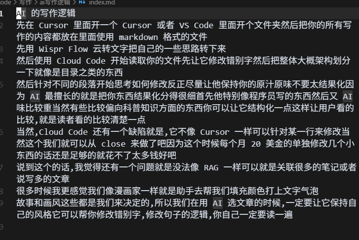
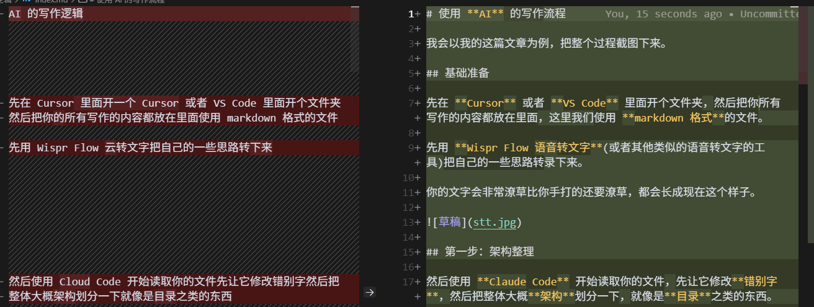
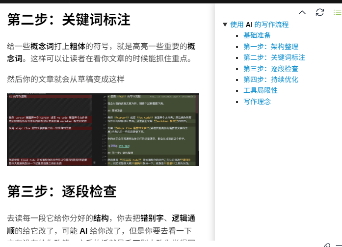

# 使用 **AI** 的写作流程

我会以我的这篇文章为例，把整个过程截图下来。

## 基础准备

先在 **Cursor** 或者 **VS Code** 里面开个文件夹，然后把你所有写作的内容都放在里面，这里我们使用 **markdown 格式**的文件。

先用 **Wispr Flow 语音转文字**(或者其他类似的语音转文字的工具)把自己的一些思路转录下来。

你的文字会非常潦草比你手打的还要潦草，会长成现在这个样子。

## 第一步：架构整理

然后使用 **Claude Code** 开始读取你的文件，先让它修改**错别字**，然后把整体大概**架构**划分一下。

然后针对不同的**段落**开始思考如何修改，反正尽量让它保持你的**原汁原味**，不要太**结构化**，因为 **AI** 最擅长的就是把你东西**结构化**并且让它长的向教程或者论文一样。这就导致会公式化，也就是所谓 **AI 味**比较重。

当然有些比较偏向**科普知识**方面的东西，你可以让它**结构化**一点，逻辑强一点，这样让**读者**看懂。

## 第二步：关键词标注

给一些**概念词**打上**粗体**的符号，就是高亮一些重要的**概念词**。这样可以让读者在看你文章的时候能抓住重点。

然后你的文章就会从**草稿**变成这样

## 第三步：逐段检查

接着去读每一段它给你分好的**结构**，你去把**错别字**、**逻辑通顺**的给它改了，可能 **AI** 给你改了，但是你要去看一下它有没有给你改错。

之后别去改你觉得写得不好的东西——当然这里的写得不好的指的不是**错别字**、**逻辑通顺**的问题，而是所谓的觉得自己写的很差——因为这个就是你的**风格**，你的**风格**是在成长的，这会让别人觉得你这个不是 **AI** 写的。

大部分人读的书不多，写的不好很正常，写得好又**逻辑通顺**，又没有 **AI 味**，是非常**困难**的事情。

这也是我所欠缺的，读的少写得少。

## 第四步：持续优化

不断的**修改整理**，然后重复这个**流程**，一直到你觉得满意为止。

## 工具局限性

当然，**Claude Code** 还有一个缺陷就是，它不像 **Cursor** 一样可以针对**某一行**来修改。不过这个我们就可以从 **Cursor** 来做了，每个月**20 美金**的单独修改几个小东西的话还是足够的。

还有一个问题就是没法像 **RAG** 一样可以关联很多的**笔记**或者说很多的**文章**。

## 写作理念

我们需要放下你对电脑说话的**羞耻感**，不要担心自己会说错话因为 AI 会帮你整理**错字**或有**不通顺**的逻辑。这个也是代表我们是**人类**的一种方式，意味着这不是百分百 AI 写的，现在我看到很多一看就是 AI **从头写到尾**的我就不想看了，反而它有点潦草那种我就觉得是自己写的，会有自己的思考，我会去认真看。

这里我们的定位就是**漫画家**一样，**AI**就是我们的**助手**，去帮我们填充颜色、打上**文字气泡**。

**故事**和**画风**这些都是我们来决定的，所以我们在用 **AI** 写文章的时候，一定要让它保持自己的**风格**，也就是所谓的**注入灵魂**。它可以帮你修改**错别字**，修改句子的**逻辑**，但是绝对不能替代你**思考**。

AI 只是**辅助**我们写作，并不是 AI **替代**我们写作。

最后再补充一点,作为在**家里办公**或者**独立开发者**,使用**语音**转**文字**对我们绝对是有好处，能让我们多说话,也会帮助练习到我们说话的技巧和口语表达。

更重要的是，我们能写更多的文章，能让我们多写，不害怕去写。
