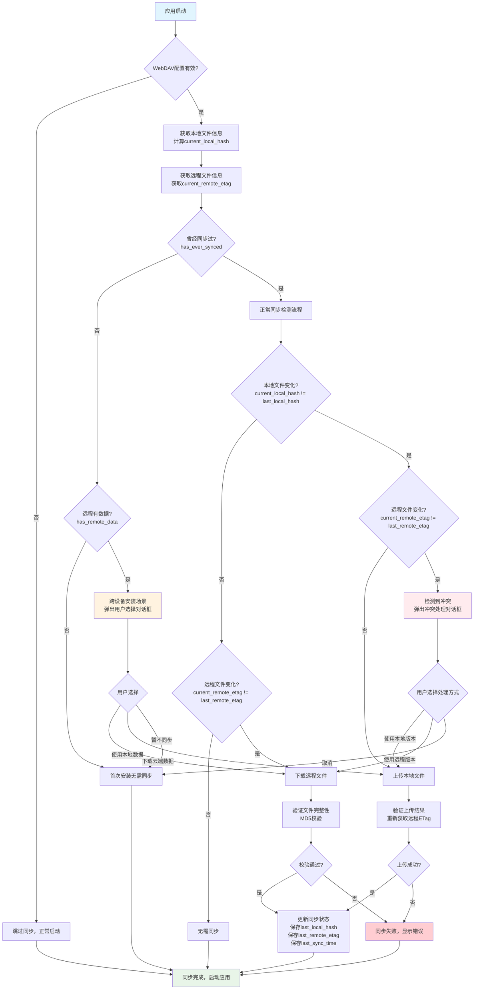

# 前言

我的记账软件，我想做成**全平台**的应用。最开始我是使用 **Electron** 写的桌面软件，使用 **SQLite** 文件，当时我没有想好做 iOS、Android，就是试试水。我的想法是**大模型**对账单分析，自动分类归档。

但是有一个问题，大部分人消费每天可能就是那点。如果使用**快捷记账** + **大模型分类**的方式效率要高一点。最重要的一点是，当时就知道这是什么消费，可以及时的矫正放入正确的数据，这样回溯起来有意义。

所以我又在 **Flutter** 上开发了一个全新数据结构的应用（原本的数据结构就是一坨）。我就开始思考**全平台同步数据**的问题。

## 数据同步方案的探索

一开始我想用一个开源的同步 **SQLite** 数据的服务，结果发现它是一个把 **SQLite → PostgreSQL** 的过程。

我来详细解释一下：首先在 **Postgres** 中定义类似的数据结构，然后通过第三方开源部署一个后端服务。在设备数据修改的时候需要先经过后端服务，然后再存储到数据库里面。第二个设备登录的时候再把它拉下来。

我弄了半天发现配置起来还是挺麻烦的，所以我果断选择 **iCloud** 的同步方式。

但是这又有一个问题：我的 **Flutter** 写的应用覆盖了 Android 和 iOS，加上我有 **Web** 端。Web 端可以使用 **WASM** 搞一个 SQLite file 在浏览器里面并读取。

但是 iCloud 不是一个通用的**全平台方案**。最后我想到了 **WebDAV**，起初我并不知道 WebDAV 是什么？

后来了解了才知道，其实就是基于 **HTTP 特殊请求方法**的文件同步机制。

我又意识到，我作为一个记账软件，只有几百 KB 的数据。数据的增长也是非常缓慢的，几十万条流水也不过是几 M 左右，大部分时间都是几百 KB。所以**同步速度**非常快，也非常丝滑。

## 技术选择

在具体实现上，我选择了一些成熟的技术方案：

**HTTP 请求库**：使用 **Dio** 来发送 WebDAV 的各种 HTTP 请求。Dio 是 Flutter 中非常强大的 HTTP 客户端，支持拦截器、超时设置、文件上传下载等功能。用它来处理 WebDAV 的 PROPFIND、PUT、GET 等方法非常方便。

具体来说，Dio 在我们的同步场景中负责：

- **连接测试**：发送 PROPFIND 请求检查服务器连通性
- **文件信息获取**：获取远程文件的修改时间、大小、ETag 等元数据
- **文件上传**：用 PUT 方法把本地数据库文件上传到服务器
- **文件下载**：用 GET 方法从服务器下载数据库文件
- **认证处理**：自动添加 Basic Auth 头进行身份验证

**本地存储**：使用 **SharedPreferences** 来持久化存储同步配置和状态信息。SharedPreferences 是 Flutter 提供的简单键值对存储，适合存储应用配置、用户设置这类小量数据。

在同步功能中，SharedPreferences 主要存储：

- **WebDAV 配置**：服务器地址、用户名、密码
- **同步状态**：上次同步时间、本地文件 Hash、远程文件 ETag
- **设备标识**：是否首次配置、是否曾经同步过等状态

这样每次应用启动时，我们就能从 SharedPreferences 读取这些信息，判断是否需要同步以及如何同步。

**文件变动监听**：使用 **watcher** 库来实时监听本地数据库文件的变化。每当本地数据更新的时候（比如用户添加了一笔交易，或者修改了账户信息），watcher 会立即检测到文件变动，这时候我们可以：

1. 重新计算本地文件的 MD5 Hash
2. 触发自动同步检测
3. 根据同步策略决定是否立即上传

这样就不用等到下次应用启动才发现数据变化了，可以做到**准实时的数据同步**。当然，具体是否立即同步还是延迟一段时间批量同步，可以根据用户的网络环境和使用习惯来调整。

## 同步思路

### 核心原理

同步的思路非常简单，利用**两个锚点**：

- **本地锚点**：本地文件的 **MD5 Hash**
- **远程锚点**：远程文件的 **ETag**

**什么是这两个标识？**

- **MD5 Hash**：表示文件的身份 ID，只要内容变了那么它就变了
- **ETag**：表示服务器资源的标识，如果服务器资源变了，它也就变了（这里涉及到 HTTP Cache 所以不多讲了）

### 需要存储的数据

我们需要持久化保存：

- **上一次的 Hash**（本地文件的历史状态）
- **上一次远程文件的 ETag**（远程文件的历史状态）

### 同步过程中用到的变量

在整个同步逻辑中，我们会用到这些关键变量：

**基础配置**：

- `webdav_url`: WebDAV 服务器地址
- `webdav_username`: 用户名
- `webdav_password`: 密码

**文件状态标识**：

- `current_local_hash`: 当前本地文件的 MD5 值
- `current_remote_etag`: 当前远程文件的 ETag 值
- `last_local_hash`: 上次同步时保存的本地文件 MD5 值
- `last_remote_etag`: 上次同步时保存的远程文件 ETag 值

**同步历史记录**：

- `last_sync_time`: 最后一次同步的时间戳
- `has_ever_synced`: 是否曾经进行过同步（通过检查上述三个值是否存在来判断）

**设备状态判断**：

- `is_first_time_configured`: 是否第一次配置 WebDAV
- `is_recently_installed`: 是否最近安装（可以通过应用安装时间判断）
- `has_remote_data`: 远程是否存在数据文件

### 同步判断逻辑

当我们同步的时候，将上一次的 Hash 和现在的文件的 Hash 比较，上一次文件的 ETag 和现在 ETag 的比较，把它们**排列组合**：

| 本地文件状态 | 远程文件状态 | 同步动作     | 说明         |
| ------------ | ------------ | ------------ | ------------ |
| 未变化       | 未变化       | 无需同步     | 两边都没变   |
| 未变化       | 已变化       | **自动下载** | 服务器有更新 |
| 已变化       | 未变化       | **自动上传** | 本地有更新   |
| 已变化       | 已变化       | **冲突处理** | 两边都有更新 |

**判断依据的优先级**：

1. **同步历史记录**（最可靠）- 如果存在 `lastSyncTime`、`lastLocalHash`、`lastRemoteHash`，说明设备曾经同步过
2. **文件时间戳+大小**（性能最佳）- 适用于大多数明确的情况，避免不必要的文件下载
3. **MD5 内容对比**（准确性最高）- 仅在必要时使用，确认真正的冲突
4. **用户选择**（最终方案）- 当自动检测无法确定时

### 为什么可以自动同步？

这里你可能要问，为什么**自动下载/上传**？因为我的应用最开始的设定就是一个**个人使用的单机软件**，一个人不会有协作的可能。所以这种情况下是没有冲突的，因为用户只会一次操作一个设备，并且更多的是把 WebDAV 作为一个**备份**。

### 冲突处理

说到**冲突**，只有一种情况：本地 Hash 和上一次 Hash 不一样，上一次的 ETag 和这一次的 ETag 不一样。

说明**本地文件发生改变**，**远程文件发生改变**。这表明了本地进行了修改，但是另外一个设备也进行了修改同步了上去，但是优先于当前设备的同步时间。

所以这个时候就需要**提示用户**：你是想要上传还是下载？它们的动作都是**覆盖当前文件**。

**为什么会出现这种情况？** 不是说了用户都是单机个人吗？我们要考虑几种情况：

- 可能是**网络信号不好**就没有传上去，或者 download 下来
- 也可能是这个手机改了点东西上传了，但是那个手机在没有被杀进程的情况下打开

当然这种情况可以规避，比如应用切出去了，再切进来触发一次同步。

### 特殊情况处理

还有一个很重要的场景：**跨设备安装**。

比如你在设备 A 使用应用并同步了数据，然后在设备 B 新安装应用。这时候：

- 本地：默认的样例数据
- 远程：设备 A 的真实数据
- 同步历史：没有记录（新设备）

这种情况下，我们不能直接下载覆盖，因为不知道这是新设备还是真的首次安装。所以需要：

1. **检测特征**：`!hasEverSynced` && `isFirstTimeConfigured` && `hasRemoteData`
2. **用户确认**：弹出对话框让用户选择是否下载云端数据
3. **安全优先**：默认推荐下载（因为多数情况是跨设备安装）

## Web 端的特殊实现

Web 端的同步逻辑基本一样，但有一些特殊的处理：

**文件存储位置不同**：Web 端不是把数据库文件存在本地文件系统，而是存在浏览器的 **OPFS**（Origin Private File System）里面。OPFS 是一个浏览器提供的私有文件系统，可以让 Web 应用像操作本地文件一样读写数据，并且数据会持久化保存。

**跨域问题**：Web 端访问 WebDAV 服务器会遇到 **CORS**（跨域资源共享）问题，因为浏览器的同源策略限制。

解决方案分两种：

- **开发环境**：使用 **Vite 的 proxy** 功能，配置代理转发请求，绕过跨域限制
- **生产环境**：在服务器上配置 **Nginx** 反向代理，将 WebDAV 请求通过同域转发到实际的 WebDAV 服务器

其他的同步逻辑、状态管理、冲突处理什么的都是一样的。

## 同步流程图

下面是整个 WebDAV 同步检测的完整流程：

