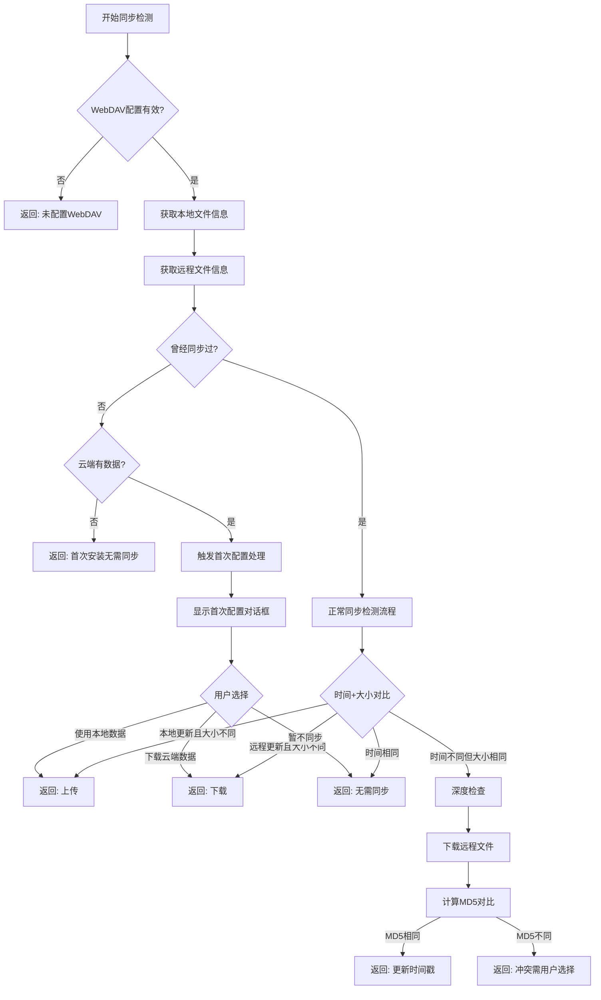

# 数据同步检测流程设计文档

## 1. 问题背景

### 1.1 当前存在的问题

#### 时区问题 ✅ 已修复
- **问题描述**：WebDAV服务器返回UTC时间，与本地时间比较时存在时区差异
- **解决方案**：在WebDAVClient中将服务器时间转换为本地时间
- **修复位置**：`webdav_client.dart:246-248`

#### 跨设备安装问题 ❗ 待解决
- **问题描述**：用户在设备A使用并同步数据，在设备B安装应用时被误判为"首次安装"
- **场景示例**：
  - 设备A：使用应用 → 产生数据 → 同步到云端
  - 设备B：新安装 → 检测为"首次安装" → 跳过同步 → 用户看不到设备A的数据
- **根本原因**：无法可靠区分"真正首次安装"与"跨设备安装"

#### MD5检测性能问题 ❗ 待优化
- **问题描述**：每次冲突检测都下载完整文件计算MD5，浪费带宽和时间
- **影响**：同步检测缓慢，用户体验差

### 1.2 技术挑战

#### 跨设备安装的不可区分性
从单个设备视角看，以下场景完全相同：
- **场景A（真正首次安装）**：本地默认数据 + 云端无数据
- **场景B（跨设备安装）**：本地默认数据 + 云端有其他设备数据

**关键问题**：在配置WebDAV之前，两种场景在本地设备上的状态完全一致。

#### 样例数据的干扰
- 新安装的应用包含样例数据（交易记录、账户等）
- 无法通过数据内容区分样例数据和真实用户数据
- 不能依赖数据库内容判断是否为用户数据

## 2. 检测策略设计

### 2.1 混合检测策略

采用**三阶段检测**：快速检查 → 深度检查 → 用户确认

#### 阶段一：快速检查（仅元数据）
```
输入：本地文件信息 + 远程文件元数据（PROPFIND）
检查：时间戳 + 文件大小 + 同步历史
输出：直接同步 / 进入深度检查 / 无需同步
```

#### 阶段二：深度检查（下载+MD5）
```
触发条件：
- 时间不同但大小相同（可能是假冲突）
- 强制同步模式
- 用户手动触发完整检查

步骤：
1. 下载远程文件
2. 计算MD5对比
3. 确定同步方向或冲突
```

#### 阶段三：用户确认
```
触发条件：
- 检测到真正冲突
- 首次配置WebDAV且云端有数据
- 检测失败的不确定情况

交互：显示详细信息，让用户选择处理方式
```

### 2.2 检测依据优先级

1. **同步历史记录**（最可靠）
   - `lastSyncTime`、`lastLocalHash`、`lastRemoteHash`
   - 如果存在同步记录，说明设备曾经同步过

2. **文件时间戳+大小**（性能最佳）
   - 适用于大多数明确的情况
   - 避免不必要的文件下载

3. **MD5内容对比**（准确性最高）
   - 仅在必要时使用
   - 确认真正的冲突

4. **用户选择**（最终方案）
   - 当自动检测无法确定时
   - 提供安全的默认选项

## 3. 流程设计

### 3.1 主检测流程



### 3.2 快速检查决策表

| 本地时间 | 远程时间 | 大小关系 | 同步历史 | 决策 | 原因 |
|---------|---------|---------|---------|------|------|
| 无文件   | 有文件   | -       | 无      | 下载 | 跨设备安装 |
| 有文件   | 无文件   | -       | 无      | 提示选择 | 可能是首次安装 |
| 较新     | 较旧     | 不同    | 有      | 上传 | 本地明确更新 |
| 较旧     | 较新     | 不同    | 有      | 下载 | 远程明确更新 |
| 相同     | 相同     | 相同    | 有      | 跳过 | 文件相同 |
| 不同     | 不同     | 相同    | 有      | 深度检查 | 可能假冲突 |

### 3.3 深度检查触发条件

```dart
bool shouldTriggerDeepCheck(
  DateTime? localTime,
  DateTime? remoteTime,
  int localSize,
  int remoteSize,
  bool hasHistory
) {
  // 时间不同但大小相同 - 可能是假冲突
  if (localTime != null && remoteTime != null && 
      localSize == remoteSize && 
      localTime != remoteTime) {
    return true;
  }
  
  // 强制同步模式
  if (forceFullCheck) {
    return true;
  }
  
  // 检测失败时的保守策略
  if (detectFailed) {
    return true;
  }
  
  return false;
}
```

## 4. 边界情况处理

### 4.1 跨设备安装场景

#### 场景描述
- 设备A：用户使用 → 同步数据到云端
- 设备B：新安装 → 配置相同WebDAV → 触发同步检测

#### 检测特征
```dart
bool isProbablyCrossDeviceInstall() {
  return !hasEverSynced &&           // 从未同步过
         isRecentlyInstalled &&      // 最近安装
         isFirstTimeConfigured &&    // 第一次配置WebDAV  
         hasRemoteData;              // 云端有数据
}
```

#### 处理策略
1. **自动推荐下载**：显示"发现云端数据，正在同步..."
2. **提供选择**：让用户确认是否下载云端数据
3. **安全优先**：默认选择保护数据的选项

### 4.2 真正首次安装场景

#### 场景描述
- 用户第一次使用应用
- 本地：默认数据库文件
- 云端：无数据

#### 处理策略
- 直接跳过同步
- 显示"首次安装，准备就绪"

### 4.3 应用重装场景

#### 场景描述
- 用户删除应用后重新安装
- 同步历史丢失，但云端数据仍存在

#### 检测困难
- 与跨设备安装场景无法区分
- 需要用户手动确认

#### 处理策略
- 按跨设备安装处理
- 提供恢复选项

### 4.4 网络异常场景

#### 常见问题
- 无法连接WebDAV服务器
- 请求超时
- 权限不足

#### 处理策略
```dart
try {
  final remoteInfo = await getRemoteFileInfo();
  // 正常处理
} catch (NetworkException e) {
  return SyncCheckResult.error('网络连接失败，使用本地数据');
} catch (AuthException e) {
  return SyncCheckResult.error('认证失败，请检查WebDAV配置');
} catch (TimeoutException e) {
  return SyncCheckResult.error('连接超时，稍后再试');
}
```

### 4.5 文件损坏场景

#### 检测方法
- MD5校验失败
- 数据库文件无法打开
- 文件大小异常

#### 处理策略
1. **本地文件损坏**：自动下载云端数据
2. **云端文件损坏**：使用本地数据并重新上传
3. **都损坏**：提示用户，使用备份

## 5. 用户交互设计

### 5.1 首次配置WebDAV时的处理

#### 检测到云端有数据
```dart
Future<void> _showFirstTimeSyncDialog() async {
  return showDialog<SyncDirection>(
    context: context,
    barrierDismissible: false,
    builder: (context) => AlertDialog(
      title: Row(
        children: [
          Icon(Icons.cloud_download, color: Colors.blue),
          SizedBox(width: 8),
          Text('发现云端数据'),
        ],
      ),
      content: Column(
        mainAxisSize: MainAxisSize.min,
        crossAxisAlignment: CrossAxisAlignment.start,
        children: [
          Text(
            '云端已有数据文件，这可能是：',
            style: TextStyle(fontWeight: FontWeight.w500),
          ),
          SizedBox(height: 12),
          _buildOptionRow(Icons.phone_android, '您在其他设备上的数据'),
          _buildOptionRow(Icons.backup, '之前的备份数据'),
          SizedBox(height: 16),
          Container(
            padding: EdgeInsets.all(12),
            decoration: BoxDecoration(
              color: Colors.blue.shade50,
              borderRadius: BorderRadius.circular(8),
            ),
            child: Row(
              children: [
                Icon(Icons.info_outline, color: Colors.blue),
                SizedBox(width: 8),
                Expanded(
                  child: Text(
                    '推荐选择"下载云端数据"以避免数据丢失',
                    style: TextStyle(color: Colors.blue.shade700),
                  ),
                ),
              ],
            ),
          ),
        ],
      ),
      actions: [
        TextButton(
          onPressed: () => Navigator.of(context).pop(SyncDirection.none),
          child: Text('暂不同步'),
        ),
        TextButton(
          onPressed: () => Navigator.of(context).pop(SyncDirection.upload),
          child: Text('使用本地数据\n(覆盖云端)'),
        ),
        ElevatedButton(
          onPressed: () => Navigator.of(context).pop(SyncDirection.download),
          style: ElevatedButton.styleFrom(
            backgroundColor: Colors.blue,
          ),
          child: Text('下载云端数据\n(推荐)'),
        ),
      ],
    ),
  );
}
```

### 5.2 Splash页面状态提示

#### 不同场景的提示文案
```dart
String getSyncStatusText(SyncCheckResult result) {
  switch (result.direction) {
    case SyncDirection.download:
      if (isProbablyCrossDeviceInstall) {
        return '发现您的云端数据，正在同步...';
      } else {
        return '正在下载最新数据...';
      }
      
    case SyncDirection.upload:
      return '正在上传本地数据...';
      
    case SyncDirection.none:
      if (isFirstInstall) {
        return '欢迎使用 Flowm';
      } else {
        return '数据已是最新';
      }
      
    case SyncDirection.conflict:
      return '检测到数据差异，请选择处理方式';
      
    default:
      return '正在检查数据同步...';
  }
}
```

### 5.3 冲突处理对话框增强

#### 显示详细的文件信息
```dart
Widget _buildConflictDetails(SyncConflict conflict) {
  return Column(
    crossAxisAlignment: CrossAxisAlignment.start,
    children: [
      Text('数据对比：', style: TextStyle(fontWeight: FontWeight.bold)),
      SizedBox(height: 8),
      
      // 本地文件信息
      _buildFileInfoCard(
        title: '本地数据',
        icon: Icons.phone_android,
        time: conflict.localModified,
        size: conflict.localSize,
        isRecommended: conflict.localModified.isAfter(conflict.remoteModified),
      ),
      
      SizedBox(height: 8),
      
      // 远程文件信息
      _buildFileInfoCard(
        title: '云端数据', 
        icon: Icons.cloud,
        time: conflict.remoteModified,
        size: conflict.remoteSize,
        isRecommended: conflict.remoteModified.isAfter(conflict.localModified),
      ),
    ],
  );
}
```

## 6. 技术实现要点

### 6.1 核心检测函数

#### 主检测逻辑
```dart
Future<SyncCheckResult> checkStartupSync() async {
  try {
    // 1. 基础检查
    final config = await WebDAVConfig.load();
    if (!config.isValid) {
      return SyncCheckResult.noSync('未配置WebDAV服务器');
    }
    
    // 2. 获取文件信息
    final localInfo = await _getLocalFileInfo();
    final remoteInfo = await _getRemoteFileInfo();
    
    // 3. 检查同步历史
    final hasHistory = await _hasEverSynced();
    
    // 4. 特殊情况处理
    if (!hasHistory) {
      return await _handleFirstTimeSync(localInfo, remoteInfo);
    }
    
    // 5. 正常同步检测
    return await _normalSyncCheck(localInfo, remoteInfo);
    
  } catch (e) {
    return SyncCheckResult.error('同步检测失败: $e');
  }
}
```

#### 首次同步处理
```dart
Future<SyncCheckResult> _handleFirstTimeSync(
  LocalFileInfo? localInfo,
  RemoteFileInfo? remoteInfo,
) async {
  // 无本地无远程
  if (localInfo == null && remoteInfo == null) {
    return SyncCheckResult.noSync('全新安装，无需同步');
  }
  
  // 无本地有远程 - 跨设备安装
  if (localInfo == null && remoteInfo != null) {
    return SyncCheckResult.download('检测到云端数据，建议下载');
  }
  
  // 有本地无远程 - 可能是首次使用
  if (localInfo != null && remoteInfo == null) {
    // 检查是否为默认数据库
    final isDefault = await _isDefaultDatabase();
    if (isDefault) {
      return SyncCheckResult.noSync('首次安装，无需同步');
    } else {
      return SyncCheckResult.upload('检测到本地数据，建议上传');
    }
  }
  
  // 有本地有远程 - 需要用户选择
  return SyncCheckResult.conflict(await _buildFirstTimeConflict(
    localInfo!, 
    remoteInfo!
  ));
}
```

#### 同步历史检查
```dart
Future<bool> _hasEverSynced() async {
  final lastSyncTime = await WebDAVConfig.getLastSyncTime();
  final lastLocalHash = await WebDAVConfig.getLastLocalHash();
  final lastRemoteHash = await WebDAVConfig.getLastRemoteHash();
  
  return lastSyncTime != null || 
         lastLocalHash != null || 
         lastRemoteHash != null;
}
```

### 6.2 性能优化实现

#### 并行处理
```dart
Future<(LocalFileInfo?, RemoteFileInfo?)> _getFileInfoParallel() async {
  // 并行获取本地和远程文件信息
  final results = await Future.wait([
    _getLocalFileInfo(),
    _getRemoteFileInfo(),
  ]);
  
  return (results[0] as LocalFileInfo?, results[1] as RemoteFileInfo?);
}
```

#### 智能MD5检查
```dart
Future<bool> _shouldCalculateMD5(
  LocalFileInfo localInfo,
  RemoteFileInfo remoteInfo,
) async {
  // 大小不同，肯定不一样
  if (localInfo.size != remoteInfo.size) {
    return false;
  }
  
  // 时间相同，可能一样
  if (localInfo.modified == remoteInfo.modified) {
    return false;
  }
  
  // 时间差很小，可能是传输造成的
  final timeDiff = localInfo.modified.difference(remoteInfo.modified).abs();
  if (timeDiff.inSeconds < 5) {
    return false;
  }
  
  // 其他情况需要MD5验证
  return true;
}
```

### 6.3 缓存策略

#### 远程文件信息缓存
```dart
class RemoteFileInfoCache {
  static final Map<String, CacheEntry> _cache = {};
  static const Duration _cacheTimeout = Duration(minutes: 5);
  
  static Future<RemoteFileInfo?> get(String path) async {
    final entry = _cache[path];
    if (entry != null && !entry.isExpired) {
      return entry.info;
    }
    
    // 缓存过期或不存在，重新获取
    final info = await _fetchRemoteFileInfo(path);
    _cache[path] = CacheEntry(info, DateTime.now());
    return info;
  }
}

class CacheEntry {
  final RemoteFileInfo? info;
  final DateTime timestamp;
  
  CacheEntry(this.info, this.timestamp);
  
  bool get isExpired => 
    DateTime.now().difference(timestamp) > RemoteFileInfoCache._cacheTimeout;
}
```

## 7. 性能优化

### 7.1 网络请求优化

#### 减少请求次数
1. **合并检查**：一次PROPFIND请求获取所有需要的元数据
2. **并行处理**：同时进行本地和远程检查
3. **智能缓存**：缓存远程文件信息，避免重复请求

#### 请求超时控制
```dart
Future<RemoteFileInfo?> _getRemoteFileInfo() async {
  try {
    return await webdavClient
        .getFileInfo(remotePath)
        .timeout(Duration(seconds: 10));
  } on TimeoutException {
    throw SyncException('服务器响应超时');
  } catch (e) {
    throw SyncException('获取远程文件信息失败: $e');
  }
}
```

### 7.2 本地操作优化

#### 延迟计算MD5
```dart
Future<String> _getLocalHashLazy() async {
  // 只在真正需要时才计算
  if (_cachedLocalHash != null && _localFileUnchanged) {
    return _cachedLocalHash!;
  }
  
  final dbFile = await getDatabaseFile();
  _cachedLocalHash = await calculateFileHash(dbFile);
  _localFileUnchanged = true;
  return _cachedLocalHash!;
}
```

#### 文件状态检查优化
```dart
Future<bool> _hasLocalFileChanged() async {
  final dbFile = await getDatabaseFile();
  final currentStat = await dbFile.stat();
  
  if (_lastKnownStat == null) {
    _lastKnownStat = currentStat;
    return true;
  }
  
  // 比较修改时间和大小
  return currentStat.modified != _lastKnownStat!.modified ||
         currentStat.size != _lastKnownStat!.size;
}
```

### 7.3 用户体验优化

#### 渐进式状态显示
```dart
// 显示检查进度
void _updateSyncProgress(String status) {
  setState(() {
    _syncProgress = status;
    _subtitleText = status;
  });
}

// 检查流程
_updateSyncProgress('正在连接服务器...');
await _checkRemoteConnection();

_updateSyncProgress('正在检查文件状态...');
await _getFileInfoParallel();

_updateSyncProgress('正在分析同步需求...');
await _analyzeSyncNeed();
```

## 8. 测试场景

### 8.1 基础功能测试

#### 首次安装测试
```
测试用例：全新用户首次安装
前置条件：
- 应用首次安装
- 未配置WebDAV
- 云端无数据

预期结果：
- 跳过同步
- 显示"首次安装，准备就绪"
- 正常进入应用
```

#### 跨设备安装测试
```
测试用例：已有用户在新设备安装
前置条件：
- 应用首次安装
- 配置相同WebDAV账号
- 云端有其他设备数据

预期结果：
- 检测到云端数据
- 显示下载提示
- 成功同步云端数据
```

### 8.2 边界情况测试

#### 网络异常测试
```
测试场景：
1. 网络断开时配置WebDAV
2. 服务器响应超时
3. 认证失败
4. 服务器返回错误状态码

预期处理：
- 显示相应错误提示
- 不影响应用正常使用
- 提供重试选项
```

#### 文件损坏测试
```
测试场景：
1. 本地数据库文件损坏
2. 云端文件损坏
3. MD5校验失败

预期处理：
- 自动使用备份或正常文件
- 提示用户文件状态
- 确保数据安全
```

### 8.3 性能测试

#### 大文件同步测试
```
测试条件：
- 数据库文件 > 10MB
- 弱网络环境
- 并发操作

性能指标：
- 检测时间 < 30秒
- 进度提示及时更新
- 可以取消操作
```

#### 并发访问测试
```
测试场景：
- 多个设备同时同步
- 同步过程中修改数据
- 网络中断后恢复

预期结果：
- 正确处理冲突
- 数据一致性保证
- 用户友好的冲突解决
```

## 9. 实施计划

### 9.1 第一阶段：修复当前问题
1. ✅ 修复时区转换问题
2. 🔄 实现跨设备安装检测
3. 🔄 添加用户选择界面

### 9.2 第二阶段：性能优化
1. 🔄 实现混合MD5检测策略
2. 🔄 添加并行处理和缓存
3. 🔄 优化网络请求

### 9.3 第三阶段：体验改进
1. 🔄 完善冲突处理界面
2. 🔄 增强状态提示
3. 🔄 添加帮助说明

### 9.4 第四阶段：测试和优化
1. 🔄 完整的测试覆盖
2. 🔄 性能调优
3. 🔄 文档完善

---

**更新日期**：2025-01-02  
**版本**：v1.0  
**作者**：Claude Code Assistant