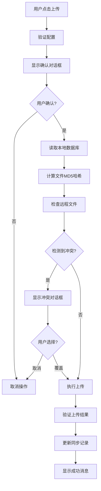
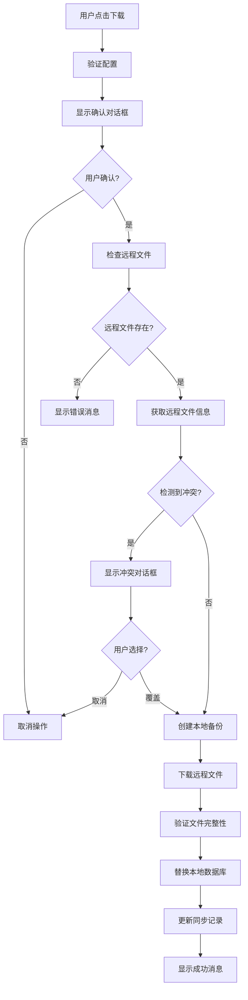

# WebDAV 数据库同步技术文档

## 1. 概述

WebDAV 数据库同步功能允许 Flowm 应用在不同设备间手动同步 SQLite 数据库文件。该功能基于 WebDAV 协议，提供安全、可靠的数据传输机制。

## 2. 核心架构

### 2.1 系统组件

```
┌─────────────────────────────────────────────────────┐
│                   用户界面层                          │
│  WebDAV 配置页面 (webdav_config_page.dart)           │
└─────────────────┬───────────────────────────────────┘
                  │
┌─────────────────┴───────────────────────────────────┐
│                   服务层                            │
│  ┌─────────────────────┐  ┌─────────────────────────┐ │
│  │ WebDAV 客户端服务   │  │ 数据库同步服务           │ │
│  │ (webdav_client.dart)│  │ (database_sync_service) │ │
│  └─────────────────────┘  └─────────────────────────┘ │
└─────────────────┬───────────────────────────────────┘
                  │
┌─────────────────┴───────────────────────────────────┐
│                   数据层                            │
│  SQLite 数据库 + SharedPreferences (同步状态)       │
└─────────────────────────────────────────────────────┘
```

### 2.2 主要类说明

- **WebDAVClient**: 处理 WebDAV 协议通信
- **DatabaseSyncService**: 管理数据库同步逻辑
- **WebDAVConfig**: 统一管理 WebDAV 配置和同步状态
- **WebdavConfigPage**: 提供用户交互界面

### 2.3 配置管理系统

为了确保配置信息的一致性和安全性，我们使用 `WebDAVConfig` 类统一管理所有 WebDAV 相关的配置：

```dart
class WebDAVConfig {
  final String url;
  final String username; 
  final String password;

  // 检查配置完整性
  bool get isValid => url.isNotEmpty && username.isNotEmpty && password.isNotEmpty;

  // 创建 WebDAV 客户端
  WebDAVClient createClient() {
    if (!isValid) throw Exception('WebDAV配置不完整');
    return WebDAVClient(baseUrl: url, username: username, password: password);
  }

  // 保存到 SharedPreferences
  Future<void> save() async { ... }

  // 从 SharedPreferences 加载
  static Future<WebDAVConfig> load() async { ... }
}
```

**配置存储键值**：
- `webdav_url`: WebDAV 服务器 URL
- `webdav_username`: 用户名
- `webdav_password`: 密码
- `last_sync_time`: 最后同步时间戳
- `last_local_hash`: 最后本地文件哈希值
- `last_remote_hash`: 最后远程文件哈希值

## 3. 工作原理

### 3.1 WebDAV 协议基础

WebDAV (Web Distributed Authoring and Versioning) 是 HTTP 协议的扩展，支持：

- **PUT**: 上传文件到服务器（创建新文件或覆盖现有文件）
- **GET**: 从服务器下载文件
- **PROPFIND**: 获取文件属性信息
- **MKCOL**: 创建目录
- **OPTIONS**: 查询服务器支持的方法

#### PUT 方法的工作机制

在 WebDAV 中，HTTP PUT 是上传文件的标准方法：

```dart
final response = await http.put(
  url,
  headers: {
    'Authorization': 'Basic $credentials',
    'Content-Type': 'application/octet-stream',
    'Content-Length': fileBytes.length.toString(),
  },
  body: fileBytes, // 文件内容作为请求体
);
```

**PUT 方法的响应**：
- `201 Created`: 文件不存在，成功创建新文件
- `204 No Content`: 文件已存在，成功覆盖现有文件
- `409 Conflict`: 父目录不存在，需要先创建目录

这就是为什么我们在代码中检查这两种成功状态码：
```dart
if (response.statusCode == 201 || response.statusCode == 204) {
  return true; // 上传成功
}
```

### 3.2 认证机制

使用 HTTP Basic Authentication：

```dart
String _getAuthHeader() {
  final credentials = '$username:$password';
  final encodedCredentials = base64.encode(utf8.encode(credentials));
  return 'Basic $encodedCredentials';
}
```

### 3.3 连接测试策略

由于某些 WebDAV 服务器可能禁止 HEAD 方法并返回 403 错误，我们采用了更可靠的双重测试策略：

1. **首选方法 - PROPFIND**: 使用 WebDAV 标准的 PROPFIND 方法测试根目录
2. **备用方法 - OPTIONS**: 如果 PROPFIND 失败，尝试 OPTIONS 方法

```dart
Future<bool> testConnection() async {
  try {
    // 首先尝试 PROPFIND (WebDAV 标准方法)
    final propfindRequest = http.Request('PROPFIND', Uri.parse(baseUrl));
    // ... 设置请求头和XML body
    
    final response = await client.send(propfindRequest);
    
    // 接受的状态码：207 (Multi-Status), 200 (OK), 403 (Forbidden但连接成功)
    if ([207, 200, 403].contains(response.statusCode)) {
      return true;
    }
  } catch (e) {
    // 如果 PROPFIND 失败，尝试 OPTIONS 方法
    final optionsRequest = http.Request('OPTIONS', Uri.parse(baseUrl));
    // ... 处理 OPTIONS 响应
  }
}
```

**状态码说明**：
- `207 Multi-Status`: WebDAV 标准成功响应
- `200 OK`: 某些服务器对 PROPFIND 的成功响应  
- `403 Forbidden`: 权限不足但连接和认证成功
- `401 Unauthorized`: 认证失败，需要检查凭据
- `409 Conflict`: 父目录不存在（需要创建目录）

### 3.4 目录管理和错误处理

许多 WebDAV 服务器（如坚果云）在文件的父目录不存在时会返回 409 状态码。为了解决这个问题，我们实现了自动目录创建机制：

```dart
// 确保文件的父目录存在
Future<void> ensureDirectoryExists(String remotePath) async {
  final pathSegments = remotePath.split('/');
  // 逐级创建父目录
  String currentPath = '';
  for (int i = 0; i < pathSegments.length - 1; i++) {
    if (pathSegments[i].isNotEmpty) {
      currentPath += '/${pathSegments[i]}';
      try {
        await createDirectory(currentPath.substring(1));
      } catch (e) {
        // 忽略目录创建失败，可能已经存在
      }
    }
  }
}

// 创建目录
Future<bool> createDirectory(String remotePath) async {
  final request = http.Request('MKCOL', url);
  // 201: 创建成功, 405: 已存在
  return [201, 405].contains(response.statusCode);
}
```

### 3.5 坚果云特定配置

经过测试，坚果云 WebDAV 的最佳配置为：

- **Base URL**: `https://dav.jianguoyun.com/dav/`
- **文件路径**: `flowm-app/flowm_database.sqlite`
- **认证方式**: 第三方应用密码

```dart
String get _remoteDatabasePath {
  // 使用 flowm-app 目录，这个路径在坚果云中工作正常
  return 'flowm-app/$_databaseFileName';
}
```

**错误处理策略**：
- **404 Not Found**: 路径不存在，自动创建目录后重试
- **409 Conflict**: 父目录不存在，自动创建目录后重试
- **其他错误**: 抛出异常，包含详细错误信息

## 4. 数据同步流程

### 4.1 上传流程



**详细步骤**：

1. **配置验证**: 检查 URL、用户名、密码是否完整
2. **文件准备**: 读取本地 SQLite 数据库文件
3. **哈希计算**: 计算本地文件的 MD5 哈希值
4. **冲突检测**: 比较本地和远程文件的修改时间和哈希值
5. **文件上传**: 使用 HTTP PUT 方法上传文件
6. **完整性验证**: 上传后验证文件完整性
7. **状态更新**: 记录同步时间和文件哈希值

### 4.2 下载流程



**详细步骤**：

1. **远程检查**: 使用 PROPFIND 检查远程文件是否存在
2. **冲突检测**: 比较本地和远程文件状态
3. **备份创建**: 自动备份当前本地数据库
4. **文件下载**: 使用 HTTP GET 下载远程文件
5. **完整性验证**: 验证下载文件的 MD5 哈希值
6. **文件替换**: 用下载的文件替换本地数据库
7. **状态更新**: 记录同步信息

## 5. MD5 哈希机制详解

### 5.1 什么是 MD5 哈希

MD5 (Message Digest Algorithm 5) 是一种广泛使用的密码散列函数，可以产生一个 128 位的哈希值。

**特点**：
- **确定性**: 相同输入总是产生相同输出
- **雪崩效应**: 输入的微小变化导致输出的巨大变化
- **不可逆**: 无法从哈希值反推原始数据
- **固定长度**: 无论输入多大，输出总是 32 个十六进制字符

### 5.2 在同步中的作用

```dart
Future<String> calculateFileHash(File file) async {
  if (!await file.exists()) {
    throw Exception('文件不存在: ${file.path}');
  }

  final bytes = await file.readAsBytes();  // 读取文件所有字节
  final digest = md5.convert(bytes);       // 计算 MD5 哈希
  return digest.toString();                // 转换为十六进制字符串
}
```

### 5.3 哈希的使用场景

#### 5.3.1 文件完整性验证

**上传验证**：
```dart
// 上传前计算本地文件哈希
final localHash = await calculateFileHash(dbFile);

// 上传后下载文件重新计算哈希进行对比
final downloadedData = await webdavClient.downloadFile(fileName);
final uploadedHash = md5.convert(downloadedData).toString();

if (localHash != uploadedHash) {
  throw Exception('文件上传过程中损坏');
}
```

**下载验证**：
```dart
// 下载文件
final remoteData = await webdavClient.downloadFile(fileName);

// 计算下载数据的哈希
final downloadHash = md5.convert(remoteData).toString();

// 写入本地文件后再次验证
await dbFile.writeAsBytes(remoteData);
final localHash = await calculateFileHash(dbFile);

if (downloadHash != localHash) {
  throw Exception('文件写入过程中损坏');
}
```

#### 5.3.2 冲突检测

```dart
Future<SyncConflict?> detectConflict(String localHash, WebDAVFileInfo remoteFileInfo) async {
  // 获取上次同步时的哈希值
  final prefs = await SharedPreferences.getInstance();
  final lastLocalHash = prefs.getString('last_local_hash');
  final lastRemoteHash = prefs.getString('last_remote_hash');

  // 下载远程文件并计算哈希
  final remoteData = await webdavClient.downloadFile(fileName);
  final currentRemoteHash = md5.convert(remoteData).toString();

  // 检测变化
  final localChanged = localHash != lastLocalHash;     // 本地是否有变化
  final remoteChanged = currentRemoteHash != lastRemoteHash; // 远程是否有变化

  // 如果双方都有变化且不一致，则存在冲突
  if (localChanged && remoteChanged && localHash != currentRemoteHash) {
    return SyncConflict(...);
  }

  return null; // 无冲突
}
```

### 5.4 哈希对比示例

假设我们有以下场景：

```
初始状态:
- 本地文件哈希: a1b2c3d4e5f6...
- 远程文件哈希: a1b2c3d4e5f6...
- 上次同步记录: a1b2c3d4e5f6...

场景1 - 仅本地修改:
- 本地文件哈希: x1y2z3a4b5c6... (已变化)
- 远程文件哈希: a1b2c3d4e5f6... (未变化)
- 结论: 可以安全上传

场景2 - 仅远程修改:
- 本地文件哈希: a1b2c3d4e5f6... (未变化)
- 远程文件哈希: m1n2o3p4q5r6... (已变化)
- 结论: 可以安全下载

场景3 - 双方都修改:
- 本地文件哈希: x1y2z3a4b5c6... (已变化)
- 远程文件哈希: m1n2o3p4q5r6... (已变化)
- 结论: 存在冲突，需要用户选择
```

## 6. 数据安全机制

### 6.1 备份策略

```dart
Future<File> createBackup() async {
  final dbFile = await getDatabaseFile();
  final timestamp = DateTime.now().millisecondsSinceEpoch;
  final backupFileName = 'database_backup_$timestamp.db';
  
  // 创建备份
  final backupFile = await dbFile.copy(backupPath);
  
  // 清理旧备份（保留最新5个）
  await _cleanupOldBackups();
  
  return backupFile;
}
```

### 6.2 错误处理机制

- **网络超时**: 所有网络操作都设置30秒超时
- **认证失败**: 捕获401错误并提示用户检查凭据
- **磁盘空间**: 检查可用空间before下载
- **权限错误**: 处理文件读写权限问题

### 6.3 同步状态管理

使用 SharedPreferences 持久化存储：

```dart
// 存储同步状态
await prefs.setInt('last_sync_time', DateTime.now().millisecondsSinceEpoch);
await prefs.setString('last_local_hash', localHash);
await prefs.setString('last_remote_hash', remoteHash);
```

## 7. 用户界面设计

### 7.1 同步状态指示器

- **最后同步时间**: 显示上次成功同步的时间
- **进度条**: 实时显示上传/下载进度
- **状态消息**: 详细的操作状态反馈

### 7.2 冲突解决界面

当检测到冲突时，用户界面会显示：

- 本地文件信息（修改时间、文件大小）
- 远程文件信息（修改时间、文件大小）
- 三个选项：
  - **使用本地版本**: 上传覆盖远程文件
  - **使用服务器版本**: 下载覆盖本地文件
  - **取消**: 中止同步操作

## 8. 最佳实践

### 8.1 使用建议

1. **定期备份**: 系统会自动创建备份，建议保留重要数据的手动备份
2. **网络环境**: 在稳定的网络环境下进行同步
3. **冲突处理**: 仔细检查冲突信息再做选择
4. **权限管理**: 确保 WebDAV 服务器的读写权限正确配置

### 8.2 故障排除

- **连接失败**: 检查 URL 格式、网络连接、服务器状态
- **认证错误**: 验证用户名和密码
- **上传失败**: 检查服务器空间和权限
- **下载失败**: 确认远程文件存在

## 9. 技术限制

- **文件大小**: 适用于中小型数据库文件（建议 < 100MB）
- **并发访问**: 不支持多设备同时修改数据
- **网络依赖**: 需要稳定的网络连接
- **服务器兼容性**: 需要标准的 WebDAV 服务器支持

## 10. 未来扩展

可能的功能增强：

- **自动同步**: 基于时间或事件触发的自动同步
- **增量同步**: 只传输变化的数据部分
- **多版本管理**: 保留多个历史版本
- **加密传输**: 在传输过程中加密数据
- **压缩传输**: 压缩数据以减少传输时间

---

*该文档描述了 WebDAV 数据库同步功能的完整技术实现，包括工作原理、数据流程和安全机制。*