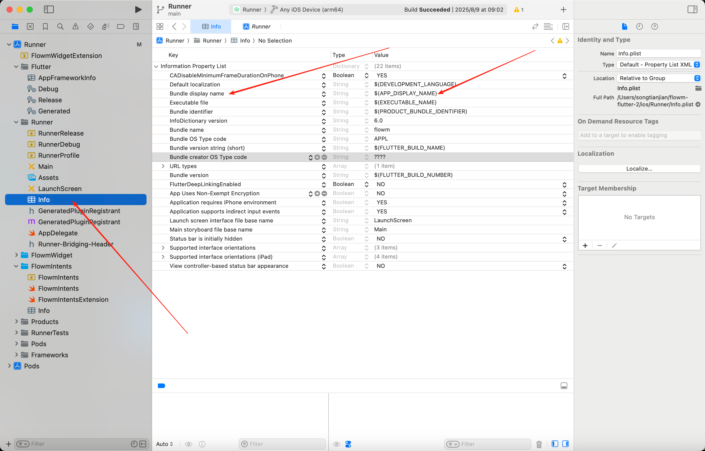

# Flutter iOS 真机上同时安装不同环境的同一应用

## 问题背景

在 iOS 上安装的应用都对应一个独一无二的 Bundle ID。在开发 Flutter iOS 应用时，我们通常使用真机进行调试，而我们的数据又是存储在本地的。

但是因为我们的 Bundle ID 是一致的，所以会导致开发时安装的 App 和从 App Store 下载下来的 App 是同一个，这就会导致数据混合的问题。

为了解决这个问题，我们需要为测试环境、开发环境以及生产环境设置不同的 Bundle ID，这样它们在 iOS 上就对应三个不同的 App。


这里我只展示两个，一个是真实发布的 bundle id，一个对应的是开发的 bundle id。

## 准备环境

在开始配置之前，请确保你已经准备好以下环境：

- MacBook
- VSCode 用来开发 flutter
- Xcode 用来打包
- iOS Simulator 用来调试

## 配置步骤

### 1. 打开 Xcode 项目

首先打开我们的 Flutter 工程的 iOS 文件，使用 Xcode 打开。

我们可以看到最上面的正中间有一个 Runner。


这个在 Xcode 里面称为 Scheme。不同的 Scheme 会对应一个不同的打包逻辑，我们在 Flutter build iOS 的时候就可以通过指定 Scheme 的名字来实现不同的打包流程。

那我们如果不指定 Scheme 的话，它默认的就是第一个 Runner。

### 2. 配置 Build Configuration

接着左边点一下 Runner 这个 Menu，接着在再点击里面 Project 下面的 Runner，继续点击 Info。


在 Configuration 模块我们可以看到 Debug/Release/Profile 分别对应不同环境下打包的一些参数。


我们在开发的时候就是默认 Debug，我们在发布的话默认就是 Release。

目前这里的 Debug、Release 和 Profile 它们配置的 Bundle ID 都是一个，所以你在开发环境使用调试，如果你发布到 App Store 里面再下载下来，就会覆盖你开发环境安装的应用，反之同理。

接着我们在 Configuration 模块，点击加号，选择 Duplicate Debug、Release。


然后我们再给它们分别改名，改叫 Debug_dev、Release_dev。

### 3. 设置 APP DISPLAY NAME

接着我们往左边看，看到 Project 下面有一个 Targets，Targets 我们依旧点击 Runner。


点击 Runner 之后我们可以看到上面的 Tab 有很多东西，接着我们点击 Build Settings。

接着点击加号，然后添加一个环境变量 APP_DISPLAY_NAME，根据不同 build configuration，设置不一样的名字。


注意这里只是注册了一个变量并不是真实的改变了打包之后的名字，我们依然要到 info.plist 里面去修改。

现在我们在 xcode 里面打开 info，然后找到 Bundle display name, 修改其 value 如图所示，改成刚刚你添加变量的名字**APP_DISPLAY_NAME**



### 4. 配置 Bundle Identifier

我们现在开始对不同的配置设置不同 Bundle ID，那么我们点回旁边的 Targets，Runner，然后我们点 General。


之后我们再去看到下面有个 Identity，我们看到有个 Bundle Identifier，然后旁边有一个箭头，我们点击一下。


点进去后，会看到有不同的 Bundle Identifier，我们填入自己的不同的就行了。


### 5. 创建新的 Scheme

fluttong 可以通过--flavor 命令来调用不同的 schema，也就是我们最开始说过的。

我们只需要创建一个新的 shcema 来对应新的 configruation 就好了。

我们点击 Manage Scheme。


点击右下角的加号。


选择默认的 runner，然后我们输入新的名字，比如 dev ，然后点击 ok 创建。


然后我们退出来之后，我们再点击 Runner，点击 Edit Scheme。


我们先选择我们刚刚创建的 Scheme。


接着我们点击左边的 Run，build configuration 改成 Debug_dev 或者你自己修改的名字。


下面的 Archive 也是一样的，切换成 Release_dev


现在为止全部配置完毕。

## vscode 配置不同的启动命令

找到 vscode 的 debug 页面，点击这个设置按钮开始配置运行命令。


直接复制我的就好了。

```json
    {
  // Use IntelliSense to learn about possible attributes.
  // Hover to view descriptions of existing attributes.
  // For more information, visit: https://go.microsoft.com/fwlink/?linkid=830387
  "version": "0.2.0",
  "configurations": [
    {
      "name": "Flutter Dev",
      "request": "launch",
      "type": "dart",
      "args": [
        "--flavor",
        "dev",
        "-t", // if your have different main file
        "lib/main.dart"
      ]
    },
    {
      "name": "Flutter Noraml",
      "request": "launch",
      "type": "dart",
      "args": [
        "-t", // if your have different main file
        "lib/main.dart"
      ]
    }
  ]
}

}

```

解释一下命令`--flavor dev`，这个是用来区分不同环境的，dev, dev 对应的是 schema 的名字，如果没有指定就是默认的 runner。

在打包的的时候记住如果要区分也要指定`--flavor dev`

```bash
flutter build ios --release --flavor dev
```
