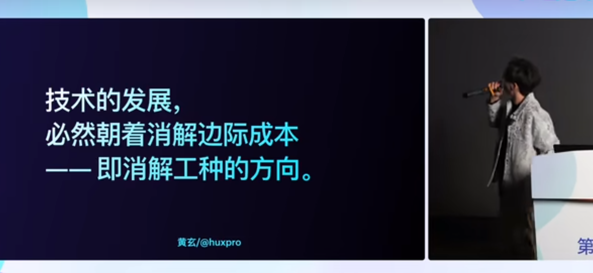
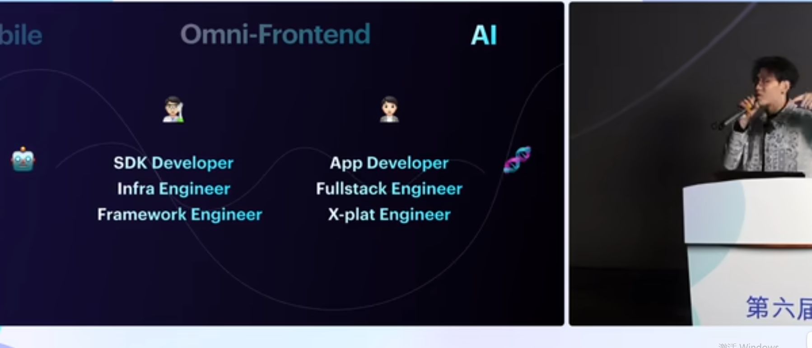
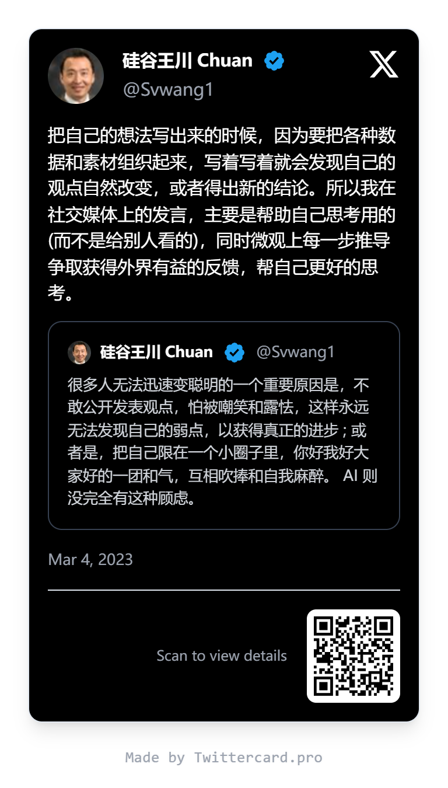

# 前端的路在哪里

## 现状思考

使用 **AI 辅助**我写代码，我一直在思考**前端的路**该怎么走。很明显，未来的道路是清晰的——**传统写前端**一定是会被 **AI 取代**的。

我们从**就业市场**就可以看出来，随着**人才逐渐饱和**，对这个市场的需求又没有这么多，然后市场又没有什么巨大的突破，没有这么多需求需要人来做，然后的话工资也是在不断地趋于普通的**白领化**。

当然 **AI** 其实还没有真正地传递到**下层市场**，比如说做一些小程序、做 2B 管理系统的，因为他们根本就没有获取到最新消息的能力。但是当这个一旦彻底传递到整个市场，那么对普通前端或者说普通的 **CRUD 程序员**是一个巨大的打击。所以我们必须要想想我们的**前进之路**在哪里。

## 个人经历与行业变迁

### 行业预言与现实冲击

在 2022 年，在 **Meta React 维护团队**出身的**黄玄**（现在去了字节跳动做 [Lynx](https://lynxjs.org/) 跨平台全端框架）做了一个演讲，他最后提出了一个暴论：**AI 终将消灭所有的程序员岗位**，但是会产生出两种不同的岗位：一种是维护系统，走在前沿的**系统工程师**；一种是做产品，对接用户的**产品工程师**。

[〖FEDAY〗我的大前端世界观 - 黄玄 Hux](https://www.bilibili.com/video/BV1SC4y1c7ju/)

### 被裁与转型思考

巧合的是，就在那个时候我刚刚**被裁**，出来准备自己创业（找外包做）或者说做**独立开发者**，所以准备自己靠做项目活下来。那个时候 **Vibe coding** 还不是一个事情。

所以我当时也只是把黄玄的话记在心里，没有太在意，只是为了活下去就想着：要不我学点其他的东西吧，只是做前端**天花板太低**。当然我只是针对我的能力有限，我是没办法做到很**底层的一些系统方面**的工作，因为以前没做过，现在就很难做到。

### 社交媒体的启发

这个时候我来到了一个**改变我人生的平台**——**Twitter**。我开始在上面关注很多**顶级程序员**，还有一些已经做了很久的**自由开发者**或者说 **freelancer**。我开始**观察他们每天发的东西**，开始学习。

给我最大的改变就是他们说：一定要做**社交媒体**，**多发你做的东西**，**多发你的思考**。本身**写出来你的想法的过程就是思考整理的过程**，更多的是你什么都不敢发的话，**别人怎么了解你呢**？就是因为这样的信息，然后我就开始在**小红书**上面发我自己的一些作品，做了一些东西，后面给我**找到了很多活**，甚至是**工作**。

[硅谷王川](https://x.com/Svwang1/status/1631774474914922497)

这里感谢

[Bear Liu](https://x.com/bearbig)
[阿崔](https://x.com/cuixr1314)
[花果山大圣](https://x.com/shengxj1)

等等，很多人给我的**思路的转变**。

这个就是所谓的 **Build in Public**，你不仅是 Build your application，或者说是在 Build 你的 **Personal Brand**。

### 全栈之路

所以我就开始思考我到底能做什么，然后我就想到我最初的**初心**：一开始在高中的时候我想做 **APP**，因为我在贴吧看到有人做 APP 赚到了钱。所以我就在想：要不我就先成为**全栈工程师**吧，什么都学会一点，毕竟现在有 **AI** 了，学习很方便。

然后我就慢慢地做，做到后面我就既能写后端、前端、APP、小程序。当然这依托于各种强大的**框架**，**原生**的我还是没有仔细学过。

当然这个全栈不是真正所谓的全栈什么都会做，而是什么都会做一点，但是在 AI 的辅助下我可以做到 60~80 分。

## AI 工具的影响

2024 年底到 2025 年初，一切都发生了改变，就像大家所知道的一样，**Cursor** 出来了。我就开始狂用 **Cursor**，我的**工作范式**、**工作习惯**也全部被改变，这让我**效率极大地提升**。有**两倍**效率的提升，但并不像当时网上自媒体吹的**十倍程序员**那样，我觉得人的精力是有限的，他不可能在多个项目上不断地切换 **context** 并且写得非常好，而且那个时候的 **Vibe Coding** 还是有一些局限的。

到了 2025 年中，**claude code** 开始传播，能力大幅度加强，效率进一步提升，我感觉到了 4x 程序员的感觉。

依旧没有所谓的 10x 程序员。

## 寻找差异化

这个时候我又开始思考了，当 **Cursor**或者**claude code** 出现的时候我在想：既然我什么都会做了，**AI** 也能帮我做，那么我是否要学一点**别人做不到的事情**？就是让自己**与众不同**的事情，就像前面所说的**系统工程师**和**产品工程师**。但是我既不懂**底层的原理**，也不懂**市场和产品**的一些底层逻辑，那么我到底适合什么呢？

后面我发现我对**设计**其实挺有兴趣的，而且我就喜欢**设计师**设计的一些设计，一些很好看的东西。要不我就去学学**设计**什么的。

然后我就开始每天逛一些**设计网站**，一些**动效的网站**，在 **X (Twitter)** 上看一些设计师发的作品。慢慢地我也感觉到我的**设计美感**稍微好了一点，但是我始终感觉中间有一层隔阂，比如说**字体的大小**、**颜色**、**间距**这些到底怎么样才是好看。而且**动画**的话还是挺复杂的。

后面我发现了一个[评奖网站](https://www.awwwards.com/)，我发现有很多 **Three.js** 相关的网站，那我在想我是不是可以学**Three.js**。所以最近我又开始学 **Three.js** 了，这样确实能让你的网站**与众不同**，跳脱出来，就跟做视频一样，你就是要搞一些有的没的**特效**把人吸引进来。虽然我实在是不喜欢那种花里胡哨的东西，但是我觉得没办法，你必须得向**市场妥协**。

## 未来展望

### AI 发展的现状

说到这里，我对**未来要走的路**有了更清晰的认识。

最近 **GPT-5** 出来了，但 **GPT-5** 并没有在**社交媒体**上爆炸开来（没有人吹爆），只是一个**渐进式改进**的模型。当然这个“一般”是在对比 **Claude 4**、**Sonnet** 这些**编程模型**，说明基于最先进的模型没有出现**革命性的突破**。

**好消息**是：我们依旧有时间去**适应和转型**。
**坏消息**是：AGI 还是很远。

### 前端的未来

随着 **Vibe Coding** 的能力越来越强，**UI 和前端绝对会合并**。

当所有人都会使用 AI 生成 App 的时候，大模型会生成长得一样的东西，什么让你脱颖而出？**产品做得非常好？长得好看？**

也许你的**品味**，让你与众不同脱颖而出。
